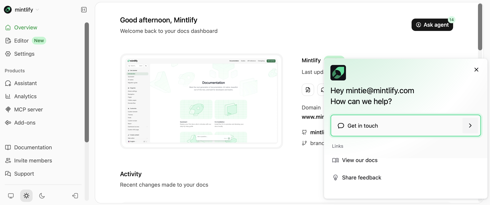
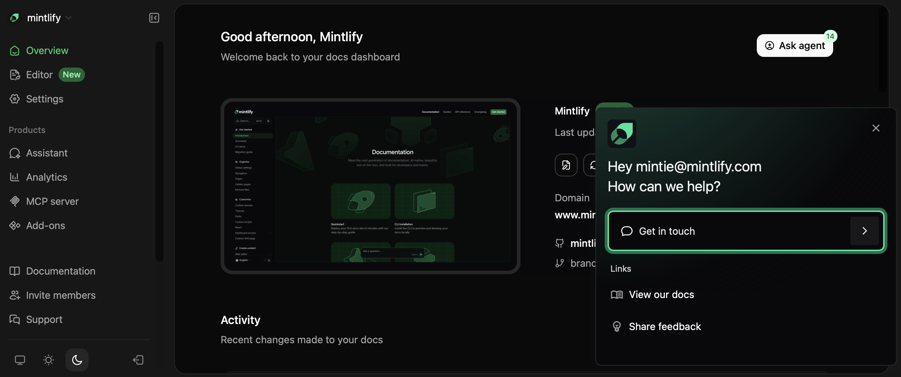

## Ask our docs

Use the keyboard shortcut <kbd>Command</kbd> + <kbd>I</kbd> (macOS) or <kbd>Ctrl</kbd> + <kbd>I</kbd> (Windows/Linux) to start a chat with our AI assistant trained on our documentation.

## Watch video tutorials

Visit our [YouTube](https://www.youtube.com/@GetDoxa/videos) channel for tutorials and guides on using Doxa.

## Message support

Send us a message from your [dashboard](https://app.doxa.com/). Click **Support** in the sidebar.

<Frame>
  
  
</Frame>

<Info>
  We aim to respond to all messages within 24 hours, but delays may occur during busy times.
</Info>

## Contact via email

If you can't access your dashboard, email us at <a href="mailto:support@doxa.com">support@doxa.com</a>. Include the URL of your [dashboard](https://app.doxa.com/) with your organization and deployment in your email so we can help you faster. For example, `app.doxa.com/your-org/your-deployment`.
